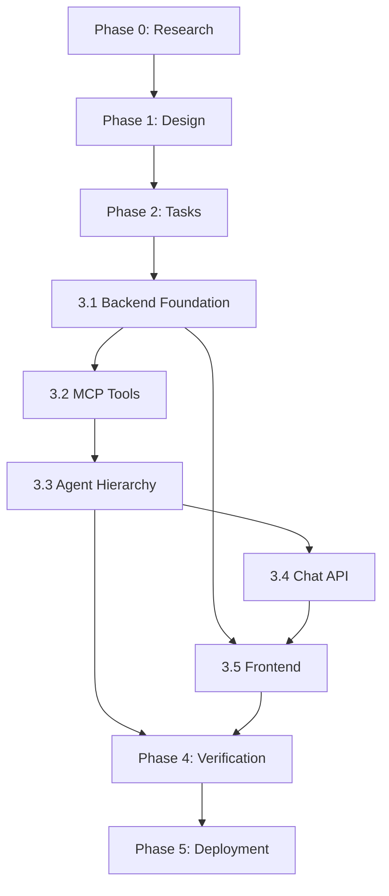

# Implementation Plan: AI Todo Chatbot (Phase 3)

**Branch**: `005-ai-todo-chatbot` | **Date**: 2026-01-11 | **Spec**: [spec.md](./spec.md)
**Input**: Feature specification from `/specs/005-ai-todo-chatbot/spec.md`

## Summary

Build an AI-powered chatbot interface for managing todos through natural language conversation. The system uses a multi-agent architecture (OpenAI Agents SDK) with 10 specialized agents, 8 MCP tools (Official MCP SDK/FastMCP), voice input support (English + Urdu), and a glass-themed ChatKit UI. All components are stateless with database persistence.

## Technical Context

**Language/Version**: Python 3.12+ (backend), TypeScript 5.x (frontend)
**Primary Dependencies**: FastAPI, OpenAI Agents SDK, FastMCP (MCP SDK), SQLModel, Next.js 16+, ChatKit
**Storage**: Neon Serverless PostgreSQL (existing)
**Testing**: pytest (backend), Jest/Vitest (frontend)
**Target Platform**: Web application (responsive)
**Project Type**: Web (frontend + backend)
**Performance Goals**: <5s chat response, <500ms MCP tool response, 100 concurrent users
**Constraints**: <200ms p95 API latency, 5 msg/min rate limit, 1000 char message limit, 100 conversations/user
**Scale/Scope**: Single-tenant multi-user, 10 agents, 8 MCP tools, 2 languages

## Constitution Check

*GATE: Must pass before Phase 0 research. Re-check after Phase 1 design.*

| Principle | Status | Notes |
|-----------|--------|-------|
| Spec-Driven Development | ✅ Pass | Following sp.plan workflow |
| Technology Stack | ✅ Pass | Using FastAPI, SQLModel, Next.js, Better Auth as mandated |
| Phase III Requirements | ✅ Pass | OpenAI Agents SDK, MCP SDK, ChatKit as specified |
| Stateless Services | ✅ Pass | Chat endpoints stateless, DB persistence |
| Multi-User Isolation | ✅ Pass | All queries filter by user_id |
| MCP Tools | ⚠️ Extended | 8 tools (spec allows 5 basic + 3 additional) |
| Clean Architecture | ✅ Pass | Agents → Tools → Repository → Database |

**MCP Tools Justification**: Constitution specifies 5 basic tools. This feature adds 3 more (uncomplete_task, get_task_analytics, search_tasks) as required by spec FR-006, FR-007, FR-008. These are additive, not replacing the core 5.

## Project Structure

### Documentation (this feature)

```text
specs/005-ai-todo-chatbot/
├── plan.md              # This file
├── research.md          # Phase 0 output
├── data-model.md        # Phase 1 output
├── quickstart.md        # Phase 1 output
├── contracts/           # Phase 1 output
│   ├── chat-api.yaml    # OpenAPI spec for chat endpoints
│   └── mcp-tools.md     # MCP tool contracts
└── tasks.md             # Phase 2 output (sp.tasks)
```

### Source Code (repository root)

```text
backend/
├── app/
│   ├── api/v1/
│   │   ├── chat.py              # Chat endpoints
│   │   └── conversations.py     # Conversation management
│   ├── models/
│   │   ├── conversation.py      # Conversation SQLModel
│   │   └── message.py           # Message SQLModel
│   ├── services/
│   │   ├── ai/
│   │   │   ├── config.py        # AI client configuration
│   │   │   ├── agents/
│   │   │   │   ├── orchestrator.py      # Main Orchestrator (Aren)
│   │   │   │   ├── language_agents.py   # Miyu, Riven
│   │   │   │   └── task_agents.py       # Elara, Kael, Nyra, Taro, Lys, Orion, Vera
│   │   │   └── tools/
│   │   │       └── task_tools.py        # 8 MCP tools
│   │   └── conversation_service.py
│   ├── middleware/
│   │   └── rate_limit.py        # Rate limiting
│   └── schemas/
│       └── chat.py              # Pydantic schemas
└── tests/
    ├── unit/
    │   ├── test_mcp_tools.py
    │   ├── test_agents.py
    │   └── test_rate_limiter.py
    └── integration/
        ├── test_chat_endpoints.py
        └── test_agent_handoffs.py

frontend/
├── app/(protected)/chat/
│   ├── page.tsx                 # Chat page
│   ├── layout.tsx               # Chat layout
│   └── components/
│       ├── ChatContainer.tsx
│       ├── ConversationList.tsx
│       ├── MessageThread.tsx
│       ├── ChatInput.tsx
│       ├── VoiceInputButton.tsx
│       └── AgentMessage.tsx
├── hooks/
│   ├── useVoiceInput.ts
│   └── useChat.ts
├── lib/
│   └── chat-client.ts
└── types/
    ├── chat.ts
    └── speech.d.ts
```

**Structure Decision**: Web application structure with separate frontend/ and backend/ directories, following existing project conventions.

## Claude Agents & Skills

### Agents (7 new)

| Agent | File | Purpose |
|-------|------|---------|
| AI Backend Engineer | `.claude/agents/ai-backend-engineer.md` | OpenAI Agents SDK, MCP tools, agent hierarchy |
| Chat Frontend Engineer | `.claude/agents/chat-frontend-engineer.md` | ChatKit UI, voice input, glass theme |
| Database Engineer | `.claude/agents/database-engineer.md` | SQLModel schemas, conversation persistence |
| API Engineer | `.claude/agents/api-engineer.md` | FastAPI endpoints, rate limiting |
| Testing Engineer | `.claude/agents/testing-engineer.md` | Unit/integration tests, mocking |
| Debugger | `.claude/agents/debugger.md` | Issue diagnosis, tracing |
| Requirement Tracer | `.claude/agents/requirement-tracer.md` | FR coverage tracking |

### Skills (10 new)

| Skill | File | Purpose |
|-------|------|---------|
| AI Chatbot Setup | `.claude/skills/ai-chatbot/ai-chatbot-setup.md` | OpenAI Agents SDK configuration |
| MCP Tools Pattern | `.claude/skills/ai-chatbot/mcp-tools-pattern.md` | @function_tool patterns |
| Agent Hierarchy Design | `.claude/skills/ai-chatbot/agent-hierarchy-design.md` | Multi-agent handoff |
| ChatKit Theming | `.claude/skills/ai-chatbot/chatkit-theming.md` | Glass theme CSS |
| Voice Input Integration | `.claude/skills/ai-chatbot/voice-input-integration.md` | Web Speech API |
| SQLModel Patterns | `.claude/skills/ai-chatbot/sqlmodel-patterns.md` | Async session, relationships |
| FastAPI Chat Endpoints | `.claude/skills/ai-chatbot/fastapi-chat-endpoints.md` | Stateless chat API |
| Agent Testing Patterns | `.claude/skills/ai-chatbot/agent-testing-patterns.md` | Mock AI, deterministic tests |
| Debugging Patterns | `.claude/skills/ai-chatbot/debugging-patterns.md` | Diagnostic utilities |
| Requirement Tracing | `.claude/skills/ai-chatbot/requirement-tracing.md` | FR-to-code mapping |

## Implementation Phases

### Phase 0: Research & Unknowns Resolution

**Goal**: Resolve technical unknowns before design

| Unknown | Research Action | Output |
|---------|-----------------|--------|
| OpenAI Agents SDK handoff pattern | Query Context7, review examples | Handoff implementation pattern |
| FastMCP tool registration | Query Context7, test locally | Tool decorator pattern |
| Web Speech API browser support | Check caniuse.com, test browsers | Compatibility matrix |
| ChatKit customization limits | Review ChatKit docs | Theming approach |

**Deliverable**: `research.md` with findings and decisions

### Phase 1: Design Artifacts

**Goal**: Create detailed design before implementation

| Artifact | Description |
|----------|-------------|
| `data-model.md` | Conversation, Message schemas with relationships |
| `contracts/chat-api.yaml` | OpenAPI spec for all chat endpoints |
| `contracts/mcp-tools.md` | MCP tool signatures and behaviors |
| `quickstart.md` | Developer setup guide |

### Phase 2: Task Generation

**Goal**: Generate implementation tasks from design

**Command**: `/sp.tasks`

**Expected Output**: `tasks.md` with dependency-ordered tasks

### Phase 3: Implementation

**Goal**: Execute tasks in order

#### 3.1 Backend Foundation
1. Database models (Conversation, Message)
2. Alembic migration
3. Repository layer
4. Conversation service

#### 3.2 MCP Tools
5. AI client configuration
6. 8 MCP tools implementation
7. Tool unit tests

#### 3.3 Agent Hierarchy
8. Task agents (7 agents)
9. Language agents (Miyu, Riven)
10. Main orchestrator (Aren)
11. Agent integration tests

#### 3.4 Chat API
12. Chat endpoints (create, list, send, delete)
13. Rate limiting middleware
14. API integration tests

#### 3.5 Frontend
15. Chat page structure
16. Glass theme components
17. Voice input hook
18. Chat client integration
19. Frontend tests

### Phase 4: Verification

**Goal**: Validate against acceptance criteria

| Criterion | Test Method |
|-----------|-------------|
| SC-001: Task creation <5s | E2E timing test |
| SC-003: Voice 90%+ accuracy | Manual testing |
| SC-004: Agent routing 95%+ | Integration tests |
| SC-007: Correct icons 100% | Unit tests |
| SC-013: Rate limit 5/min | Integration tests |

### Phase 5: Deployment

**Goal**: Deploy to production

**Agent**: `deployment-engineer`

1. Backend deployment to HF Spaces
2. Frontend deployment to Vercel
3. Environment variable configuration
4. Smoke tests

## Risk Analysis

| Risk | Probability | Impact | Mitigation |
|------|-------------|--------|------------|
| AI provider rate limits | Medium | High | Implement retry with backoff |
| Voice recognition accuracy | Medium | Medium | Fallback to text input |
| Agent routing errors | Low | Medium | Comprehensive intent tests |
| Performance under load | Low | High | Load testing before launch |

## Dependencies



## Complexity Tracking

> **No constitution violations requiring justification**

The implementation follows all constitution principles:
- Spec-driven development workflow
- Mandated technology stack
- Stateless architecture
- User isolation
- Clean architecture patterns

## Next Steps

1. ✅ Create agents and skills
2. ⏳ Generate `research.md` (Phase 0)
3. ⏳ Generate `data-model.md` (Phase 1)
4. ⏳ Generate `contracts/` (Phase 1)
5. ⏳ Generate `quickstart.md` (Phase 1)
6. ⏳ Run `/sp.tasks` for task generation (Phase 2)
